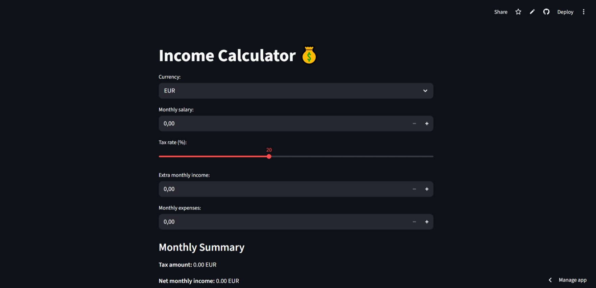

# Income Calculator 💰

A Streamlit-based Income Calculator that helps users estimate monthly and yearly net income.  
The app includes tax calculation, currency selection, income–expense visualization, yearly forecasting, and a built‑in history log for saving results.  
Clean, interactive, and ideal for quick financial insights.

---

## ✨ Features

### 💵 Income & Tax Calculation
- Enter monthly salary
- Adjustable tax rate slider
- Add extra income sources
- Automatic tax deduction calculation

### 💱 Currency Selection
- Choose between EUR, USD, GBP, or UAH
- All results displayed in selected currency

### 📉 Expenses Tracking
- Input monthly expenses
- Net income calculated instantly

### 📈 Interactive Charts
- Altair bar chart showing:
  - Salary  
  - Taxes  
  - Extra income  
  - Expenses  
  - Net income  
- Clear visual comparison of income vs. expenses

### 📆 Yearly Forecast
- Automatic yearly net income projection
- Helps estimate long-term financial stability

### 💾 Save Results (History Log)
- Save any calculation with one click
- Session-based history table
- Compare multiple scenarios in one session

---

## 🚀 Live Demo

Try the app here:  
(https://incomecalculator-bs2mecvqpgjgacn3b2efbh.streamlit.app/)

---

## 📸 Screenshots

